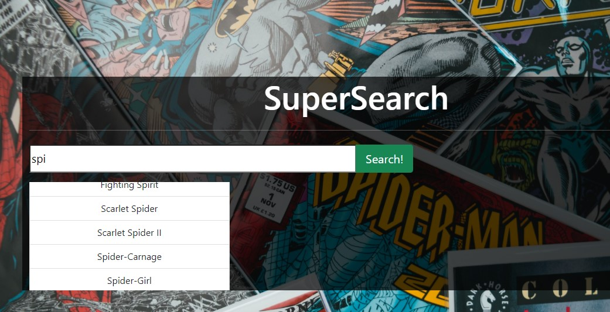

# SUPERHERO Web App

## Description
You will be building a single-page frontend application that populates superhero's information using the following APIs.

List of Superheroes:

https://akabab.github.io/superhero-api/api/all.json

Superheroes Detail:
https://akabab.github.io/superhero-api/api/id/{id}.json

Further Documentation can be found here:
https://akabab.github.io/superhero-api/api/

Please use the following tools as part of your solution:
HTML
CSS / SCSS
JS / TS along with a framework of your choice.

Your frontend capabilities will be evaluated based on your code structure, clarity and design.

## Topics
- CSS
- Javascript
- APIs
- HTML
- BOOTSTRAP

## Table of Contents
* [Description](#description)
* [Topics](#topics)
* [Installation](#installation)
* [Usage](#usage)
* [Technologies](#technologies)
* [Contributing](#contributing)
* [Test](#test)
* [Challenges](#challenges)
* [Questions](#questions)
* [Author](#Author)

## Usage
Once the site has populated in your browser, you'll be able to use the click on the search button. Enter your favorite superhero and click on 'search'.

## Technologies
- CSS
- Javascript
- APIs
- HTML
- BOOTSTRAP

## Contributing
If you would like to contribute to this project please reach out to me on Github or email.

## Challenges
I had a difficult time setting up and running my APIs

## Questions
If you have questions about this repository? Please contact me at [patrice_kelly22@yahoo.com](mailto:patrice_kelly22@yahoo.com). View more of my work in GitHub at [patrice111](https://github.com/patrice111).

## Author
Patrice Kelly 

